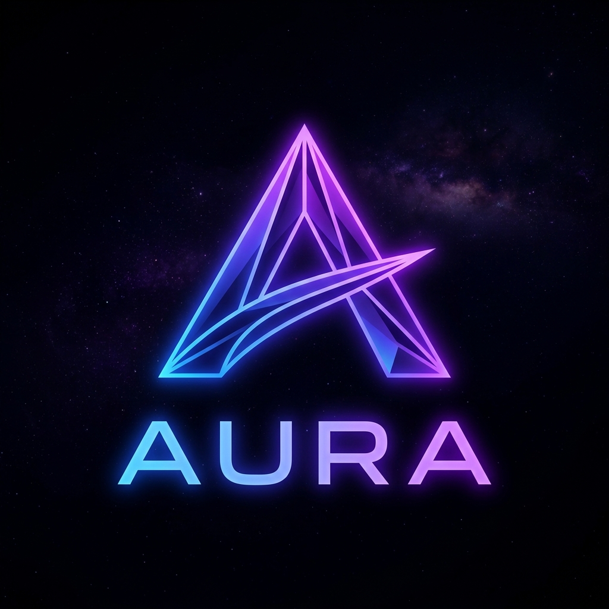

# Aura Landing Page (官方门户与沉浸式展示前台)

<p align="center">
  
</p>

<p align="center">
  <strong>构建下一代智能基座 · 极速、确定性与深度私有化的 AI 代理框架</strong>
</p>

<p align="center">
  <a href="#-项目简介">项目简介</a> •
  <a href="#-核心特性">核心特性</a> •
  <a href="#-技术栈与架构">技术栈</a> •
  <a href="#-页面板块编排">页面板块</a> •
  <a href="#-本地运行与预览">快速上手</a> •
  <a href="#-多语言支持-i18n">国际化</a>
</p>

---

## 📖 项目简介

**Aura Landing Page** 是 Aura 下一代 AI 代理框架平台的官方品牌落地页与多模态交互展示前台。

项目采用现代 Web 前端前沿设计标准，将 **深色赛博拟态 (Dark Glassmorphism)**、**全屏滑块视差动效 (Full-Page Slide Transition)** 与 **实时互动终端 (Interactive Sandbox)** 完美融合，向开发者与企业用户立体化呈现 Aura 的底层热力学演化架构、ACP 二进制总线中枢与 14+ 行业应用生态。

---

## ✨ 核心特性

- 🌌 **极致视觉美学**：精心调配的深空黑夜背景 (`#05070a`)、高对比霓虹渐变（电光紫 & 荧光青）、径向呼吸光晕与毛玻璃拟态卡片。
- 🖱️ **全维度滑块交互**：
  - 支持 **鼠标滚轮精准分屏切页**；
  - 支持 **键盘方向键 / PageUp / PageDown** 丝滑翻页；
  - 侧边悬浮指示圆点实时高亮与一键跳转；
  - 完整适配 **移动端触控滑动 (Touch Swipe)** 与响应式自适应布局。
- 🎬 **View Transitions 视图动效**：基于现代浏览器原生 `document.startViewTransition` API，实现无闪烁、电影级的平滑切屏动效。
- 🕹️ **互动式反应堆控制台 (Chaos Terminal)**：内置实时日志控制台，支持用户在前端一键触发 **OOM 混沌测试指令**，模拟系统的动态降级、沙箱隔离与熔断自愈过程。
- 🌍 **原生国际化 (i18n)**：零第三方依赖的极速多语言引擎，支持 **简体中文 (zh)**、**English (en)**、**日本語 (ja)** 无刷新实时切换，并自动持久化用户偏好。
- 🚀 **极简零构建负担**：纯原生 HTML5 + CSS3 + ES6+ JavaScript，首屏纳秒级加载，无需任何 Node.js 编译或庞大依赖打包。

---

## 🛠️ 技术栈与架构

| 层次 | 技术选型 | 说明 |
| :--- | :--- | :--- |
| **基础骨架** | HTML5 Semantic Elements | 语义化标签与无障碍访问结构 |
| **样式与动画** | Modern Vanilla CSS3 | CSS 变量系统、Glassmorphism、Flexbox/Grid、Keyframes |
| **字体系统** | Google Fonts | `Outfit` (现代科技标题) & `Inter` (高辨识度正文) |
| **切屏动效** | View Transitions API | 现代浏览器原生切页动效标准 |
| **国际化模块** | `i18n.js` (Custom Engine) | 轻量字典映射与 DOM 动态渲染引擎 |
| **媒体资源** | Optimized Web Assets | 15+ 高清 3D 渲染图与场景视觉资源 (`./images/`) |

---

## 📑 页面板块编排

```mermaid
graph TD
    A[Hero 首页 - 智能觉醒] --> B[性能基准 - 98% 延迟降低 / 60fps 同步]
    B --> C[底层基座 - 物理沙箱 / ACP 二进制总线]
    C --> D[三位一体架构 - Cortex + OS + Substrate]
    D --> E[开发者体验 - 三行 Rust 唤醒宇宙]
    E --> F[反应堆控制台 - OOM 混沌注入演练]
    F --> G[定制治理 - Persona 配置器]
    G --> H[无界生态 - 14+ 行业场景双向滚动走马灯]
    H --> I[生态矩阵 - LLM / RAG / IoT / IM 网关]
    I --> J[演进路线 - V1.0 破晓 -> V2.0 共振 -> V3.0 直连]
    J --> K[Token 经济学 - 算力即能量 / 边际成本递减]
    K --> L[终极愿景与行动号召 (CTA)]
```

---

## 🚀 本地运行与预览

本项目为纯静态前台架构，无需安装任何构建依赖，可通过任意本地静态 Web 服务器即开即用：

### 方式一：使用 Python 内置服务器（推荐）
```bash
cd /home/nick/workspaces/aura-landing-page
python3 -m http.server 8080
```
浏览器访问：`http://localhost:8080`

### 方式二：使用 Node.js `serve` / `npx`
```bash
npx -y serve .
```

### 方式三：通过 Dev Hub 控制台
在 **evotensor Dev Hub** (`https://ide.evotensor.dev`) 的项目列表中直接点击 `aura-landing-page` 即可一键拉起 Web IDE 进行在线预览与编辑。

---

## 🌐 多语言支持 (i18n)

项目字典定义在 [`i18n.js`](file:///home/nick/workspaces/aura-landing-page/i18n.js) 中：

```javascript
window.i18nData = {
    "zh": { /* 中文字典 */ },
    "en": { /* English Dictionary */ },
    "ja": { /* 日本語辞書 */ }
};
```

HTML 中只需为待翻译元素添加 `data-i18n="key"` 属性即可自动实现实时多语言绑定与无感切换。

---

## 📄 许可证

Copyright © 2026 Aura Framework Core. System Entropy: Stabilized.
